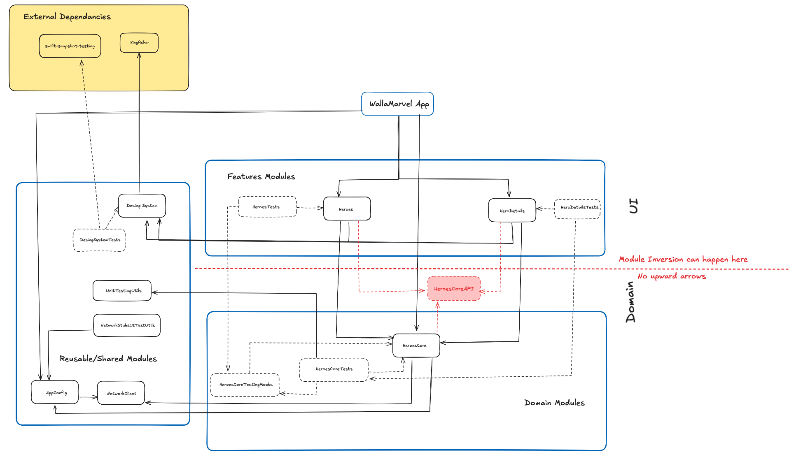

# WallaMarvel

*A tiny, modular iOS app that lists Marvel heroes and shows their details.*

## Overview
WallaMarvel uses the public Marvel API to display a **Heroes List** with infinite scrolling and a **Hero Details** screen with extra information about a selected hero. The project is organized into multiple Swift Package Manager (SPM) modules for clean separation of concerns and easy reuse.

## Tech Stack
- **SwiftUI**
- **Swift Package Manager (SPM)**
- **Structured Concurrency (async/await)**
- **iOS 15+**

## Module Dependency Graph

## Modules
The app is highly modularized using SPM:

- **DesignSystem** — Centralizes visual language and reusable UI components; provides design guidelines and principles.
- **NetworkClient** — App-agnostic HTTP client with optional middleware support.
- **AppConfig** — Centralized configuration for the app, all the configuration the modules needs from the app.
- **HeroesCore** — Data & domain layer for heroes (repositories, services, models). UI-agnostic and reusable.
- **Heroes** — Feature module that renders the **Heroes List** with pagination.
- **HeroDetails** — Feature module that renders the **Hero Details** view.
- **UnitTestingUtils** — Shared utilities used by unit tests across modules.
- **NetworkStubsUITestUtils** — setting up and defining stubs for running the UITests.

## Architecture
**MVVM + Repository + Coordinator**

- **MVVM** for feature UIs  
- **Repository** in `HeroesCore` to abstract data sources  
- **Coordinator** to drive navigation between screens (in progress)

## Caching & Offline Behavior
To provide a smooth, offline-friendly experience:

- Each fetched page from the backend is **stored in cache**.
- On app launch, we **preload all cached pages** immediately, while **refreshing the same pages from the network** in the background.
- The cache is **evicted on each launch** and repopulated from remote data to keep it consistent with the backend.
- The API limits responses to **100 heroes per call**. We perform **multiple sequential calls** when needed (e.g., 240 cached items → 3 requests).
- **First-ever launch while offline:** show a retry error view.
- **Subsequent launches while offline:** show the cached list.
- **Paginating while offline:** show a small retry view at the end of the list.
- **Race-safety:** if the user scrolls to paginate while the initial cache refresh hasn’t finished, we **defer pagination** until the refresh completes.

## Testing
- **Snapshot Tests** — `DesignSystem` components are covered with snapshot tests.
- **Unit Tests** — Each module ships its own unit tests for core logic.
- **UI Tests** — Live in the app target and cover the core user flow.

## CI
In progress…
